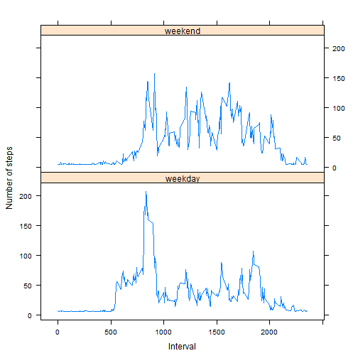

## Loading data

```r
if(!file.exists('activity.csv')){
    unzip('activity.zip')
}

activitydata_raw <- read.csv("activity.csv", stringsAsFactors=FALSE)
head(activitydata_raw)
```

```
##   steps       date interval
## 1    NA 2012-10-01        0
## 2    NA 2012-10-01        5
## 3    NA 2012-10-01       10
## 4    NA 2012-10-01       15
## 5    NA 2012-10-01       20
## 6    NA 2012-10-01       25
```

```r
# Plotting System to be used: lattice
library(lattice)
```

## Process/transform the data into a format suitable for analysis

```r
# Transform the date attribute to an actual date format
activitydata_raw$date <- as.POSIXct(activitydata_raw$date, format="%Y-%m-%d")

# Compute the weekdays from the date attribute
activitydata_raw <- data.frame(date=activitydata_raw$date, 
                               weekday=tolower(weekdays(activitydata_raw$date)), 
                               steps=activitydata_raw$steps, 
                               interval=activitydata_raw$interval)

# Create the final tidy data set
activitydata <- data.frame(date=activitydata_raw$date, 
                       weekday=activitydata_raw$weekday, 
                       interval=activitydata_raw$interval,
                       steps=activitydata_raw$steps)

head(activitydata)
```

```
##         date weekday interval steps
## 1 2012-10-01  monday        0    NA
## 2 2012-10-01  monday        5    NA
## 3 2012-10-01  monday       10    NA
## 4 2012-10-01  monday       15    NA
## 5 2012-10-01  monday       20    NA
## 6 2012-10-01  monday       25    NA
```

```r
# Clear the workspace
rm(activitydata_raw)
```
## What is mean total number of steps taken per day?

### 1. Calculate the total number of steps taken per day

```r
# Compute the total number of steps each day (NA values removed)
steps_per_day <- aggregate(activitydata$steps, by=list(activitydata$date), FUN=sum, na.rm=TRUE)

# Rename the attributes for total_steps
names(steps_per_day) <- c("date", "total_steps")
```

### 2. Make a histogram of the total number of steps taken each day

```r
hist(steps_per_day$total_steps, 
     breaks=seq(from=0, to=25000, by=2500),
     col="blue", 
     xlab="Total number of steps", 
     ylim=c(0, 20), 
     main="Histogram of the total number of steps taken each day\n(NA removed)")
```

 

### 3. Calculate and report the mean and median of the total number of steps taken per day

```r
mean(steps_per_day$total_steps)
```

```
## [1] 9354.23
```

```r
median(steps_per_day$total_steps)
```

```
## [1] 10395
```
#### *Calculated mean __9354__ and median __10395__*

## What is the average daily activity pattern?

### 1. Make a time series plot (i.e. type = "l") of the 5-minute interval (x-axis) and the average number of steps taken, averaged across all days (y-axis)

```r
# Compute the means of steps for each 5-minute interval accross all days
mean_activitydata <- aggregate(activitydata$steps, 
                       by=list(activitydata$interval), 
                       FUN=mean, 
                       na.rm=TRUE)

# Rename the attributes
names(mean_activitydata) <- c("interval", "mean")
head(mean_activitydata)
```

```
##   interval      mean
## 1        0 1.7169811
## 2        5 0.3396226
## 3       10 0.1320755
## 4       15 0.1509434
## 5       20 0.0754717
## 6       25 2.0943396
```

```r
# Generate the time series plot
plot(mean_activitydata$interval, 
     mean_activitydata$mean, 
     type="l", 
     col="blue", 
     lwd=2, 
     xlab="Interval [minutes]", 
     ylab="Average number of steps", 
     main="Time-series of the average number of steps per intervals\n(NA removed)")
```

 

### 2. Which 5-minute interval, on average across all the days in the dataset, contains the maximum number of steps?

```r
# Find the position of the maximum mean steps
max_mean_pos <- which(mean_activitydata$mean == max(mean_activitydata$mean))

# Find the value of the interval at this position
max_step_interval <- mean_activitydata[max_mean_pos, 1]
# max_step <- mean_activitydata[max_mean_pos,]

# Cleaning Workspace
rm(steps_per_day)
```
#### *The 5-minute interval that contains the maximum of steps, on average across all days, is __835__*.

## Imputing missing values

### 1. Calculate and report the total number of missing values in the dataset (i.e. the total number of rows with NAs)

```r
NA_count <- sum(is.na(activitydata$steps))
```
#### *Total number of missing values in the dataset is __2304__*

### 2. Devise a strategy for filling in all of the missing values in the dataset.

```r
# Finding all NA positions
na_pos <- which(is.na(activitydata$steps))

# Create a vector of means for steps
mean_vector <- rep(mean(activitydata$steps, na.rm=TRUE), times=length(na_pos))
```

### 3. Create a new dataset that is equal to the original dataset but with the missing data filled in.

```r
# Replacing the NAs by the means
activitydata[na_pos, "steps"] <- mean_vector
head(activitydata)
```

```
##         date weekday interval   steps
## 1 2012-10-01  monday        0 37.3826
## 2 2012-10-01  monday        5 37.3826
## 3 2012-10-01  monday       10 37.3826
## 4 2012-10-01  monday       15 37.3826
## 5 2012-10-01  monday       20 37.3826
## 6 2012-10-01  monday       25 37.3826
```

### 4. Make a histogram of the total number of steps taken each day and Calculate and report the mean and median total number of steps taken per day.

```r
# Compute the total number of steps each day (NA values replaced already)
steps_per_day <- aggregate(activitydata$steps, by=list(activitydata$date), FUN=sum)

# Rename the attributes for steps_per_day
names(steps_per_day) <- c("date", "total_steps")

# Generate the histogram of the total number of steps each day
hist(steps_per_day$total_steps, 
     breaks=seq(from=0, to=25000, by=2500),
     col="blue", 
     xlab="Total number of steps", 
     ylim=c(0, 30), 
     main="Histogram of the total number of steps taken each day\n(NA replaced by mean value)")
```

 

```r
# Calculate mean and median value
mean(steps_per_day$total)
```

```
## [1] 10766.19
```

```r
median(steps_per_day$total)
```

```
## [1] 10766.19
```
#### *Mean value is __10766__ and median value is __10766__*

## Are there differences in activity patterns between weekdays and weekends?

### 1.Create a new factor variable in the dataset with two levels - "weekday" and "weekend" indicating whether a given date is a weekday or weekend day

```r
# Adding the day type (weekend or weekday) column to the activity data
activitydata <- cbind(activitydata, 
                      daytype=ifelse(activitydata$weekday == "saturday" | 
                                     activitydata$weekday == "sunday", "weekend", 
                                     "weekday"))
head(activitydata)
```

```
##         date weekday interval   steps daytype
## 1 2012-10-01  monday        0 37.3826 weekday
## 2 2012-10-01  monday        5 37.3826 weekday
## 3 2012-10-01  monday       10 37.3826 weekday
## 4 2012-10-01  monday       15 37.3826 weekday
## 5 2012-10-01  monday       20 37.3826 weekday
## 6 2012-10-01  monday       25 37.3826 weekday
```

### 2. Make a panel plot containing a time series plot (i.e. type = "l") of the 5-minute interval (x-axis) and the average number of steps taken, averaged across all weekday days or weekend days (y-axis). 

```r
# Compute the average number of steps taken, averaged across all daytype variable
mean_daytype_steps <- aggregate(activitydata$steps, 
                       by=list(activitydata$daytype, activitydata$interval), 
                       FUN=mean)

# Rename the attributes for mean_daytype_steps
names(mean_daytype_steps) <- c("daytype", "interval", "mean")
head(mean_daytype_steps)
```

```
##   daytype interval     mean
## 1 weekday        0 7.006569
## 2 weekend        0 4.672825
## 3 weekday        5 5.384347
## 4 weekend        5 4.672825
## 5 weekday       10 5.139902
## 6 weekend       10 4.672825
```

```r
# Generate time series plot
xyplot(mean ~ interval | daytype, mean_daytype_steps, 
       type="l", 
       lwd=1, 
       xlab="Interval", 
       ylab="Number of steps", 
       layout=c(1,2))
```

 
